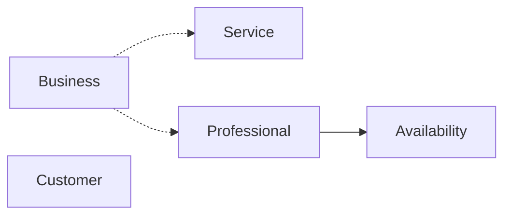

# Domain Map

Mapa atual do domínio documentado a partir do código implementado.

## Aggregates atuais

| Aggregate | Pacote principal | Responsabilidade atual |
| --- | --- | --- |
| `Business` | `com.troquim_bot.business` | Representa o salão/negócio atual do MVP, com dados de contato, horário de funcionamento e status. |
| `Service` | `com.troquim_bot.service` | Representa um serviço oferecido, com descrição, duração, preço e status. |
| `Customer` | `com.troquim_bot.customer` | Representa o cliente final, com nome, telefone, observações e status. |
| `Professional` | `com.troquim_bot.professional` | Representa um profissional do salão, com especialidades, telefone e status. |
| `Availability` | `com.troquim_bot.availability` | Representa uma janela de disponibilidade de um Professional por dia da semana e intervalo de horário. |

## Relações atuais no código

## Observações por relação

- `Availability` guarda `professionalId` como referência a `Professional`.
- `Service` existe como cadastro operacional, mas não possui `businessId` no aggregate atual.
- `Professional` existe como cadastro operacional, mas não possui `businessId` no aggregate atual.
- `Customer` existe como cadastro independente no MVP atual e não possui `businessId`.
- `Business` é tratado pelo Application Service como o Business atual do MVP.

## Estados atuais

| Aggregate | Estados atuais |
| --- | --- |
| `Business` | `TRIAL`, `ATIVO`, `INATIVO`, `SUSPENSO`, `DELETADO` |
| `Service` | `ATIVO`, `INATIVO` |
| `Customer` | `ATIVO`, `INATIVO` |
| `Professional` | `ATIVO`, `INATIVO` |
| `Availability` | `ATIVO`, `INATIVO` |

## Capacidades REST atuais

| Capability | Base path | Operações expostas |
| --- | --- | --- |
| Business Management | `/business` | Buscar/criar padrão do MVP e atualizar dados básicos. |
| Service Management | `/services` | Listar, buscar, criar, atualizar e inativar. |
| Customer Management | `/customers` | Listar, buscar, criar, atualizar e inativar. |
| Professional Management | `/professionals` | Listar, buscar, criar, atualizar e inativar. |
| Availability MVP | `/availability` | Listar, buscar, criar, atualizar e inativar. |

## Escopo

Este mapa fica restrito às capabilities atuais implementadas acima.
